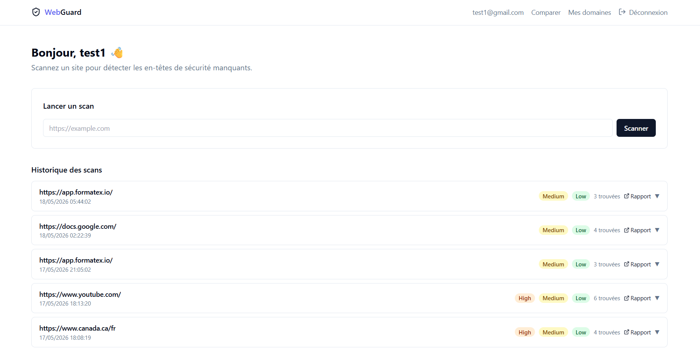
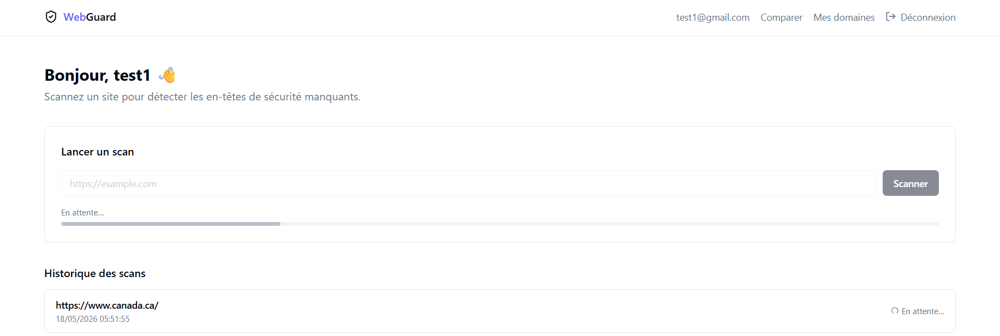
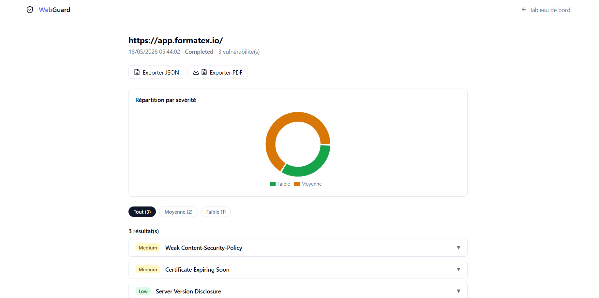
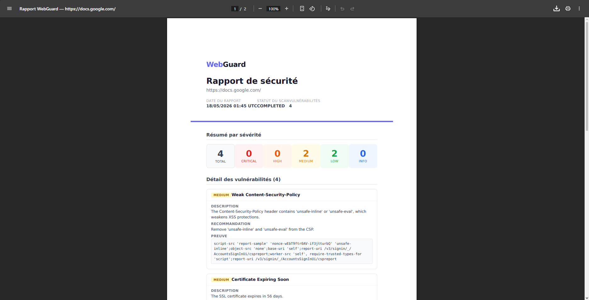
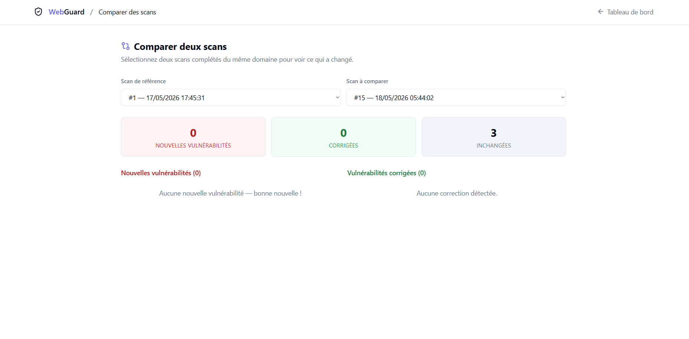
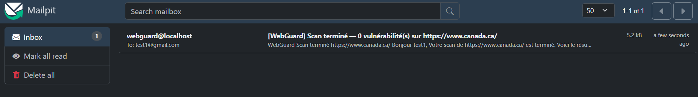

# WebGuard

Scanner de vulnérabilités web — projet portfolio Master IGOV, FSR-UM5 Rabat.

[](https://github.com/Chekroun2004/webguard/actions/workflows/ci.yml)


L'utilisateur soumet une URL → le système scanne → génère un rapport PDF/JSON avec sévérités et recommandations.

---

## Fonctionnalités

- **11 scanners** actifs et passifs : XSS réfléchi, SQLi, CSRF, open redirect, directory listing, headers de sécurité, cookies, SSL/TLS, fichiers sensibles, technologies exposées, méthodes HTTP dangereuses
- **Crawl automatique** du site cible avant les scanners actifs
- **Rapport PDF/JSON** exportable depuis l'interface
- **Scan asynchrone** : Celery + Redis, progression en temps réel via SSE
- **Vérification d'ownership** de domaine (fichier ou DNS TXT)
- **Rate limiting** : 5 scans/heure par utilisateur, 100 req/min global
- **Récupération automatique** des scans bloqués au redémarrage
- **Comparaison de scans** : page dédiée `/diff` qui met en évidence les vulnérabilités ajoutées/corrigées entre deux scans d'un même domaine
- **Notifications email** : envoi automatique d'un rapport résumé à la fin de chaque scan (Mailpit en dev, SMTP en prod)

---

## Demo

### Dashboard — liste des scans



### Scan en cours



### Détail des vulnérabilités



### Rapport PDF généré



### Comparaison de scans



### Notification email (Mailpit en dev)



---

## Quick Start

```bash
# 1. Cloner le dépôt
git clone <repo-url>
cd scan

# 2. Configurer l'environnement
cp .env.example .env

# 3. Lancer la stack complète
docker compose -f docker-compose.yml -f docker-compose.dev.yml up --build
```

| Service | URL |
|---|---|
| Frontend | http://localhost:5173 |
| API | http://localhost:8000 |
| Swagger | http://localhost:8000/docs |
| Mailpit (emails) | http://localhost:8025 |

---

## Architecture

```
Frontend (React 18 + Vite)  ──REST──▶  Backend (FastAPI)  ──queue──▶  Worker (Celery)
        :5173                               :8000                           │
                                               │                            │
                                               ▼                            ▼
                                         PostgreSQL 15                  Redis 7
```

**Layering backend (strict) :**

```
Routes (app/api/v1/)
  └─▶ Services (app/services/)       ← logique métier
        └─▶ Repositories (app/repositories/)  ← accès DB
              └─▶ Models (app/db/models/)      ← SQLAlchemy ORM
```

---

## Stack technique

| Couche | Technologie |
|---|---|
| Backend | FastAPI 0.115, Python 3.11 |
| Workers | Celery 5.4, Redis 7 |
| Base de données | PostgreSQL 15, SQLAlchemy 2.0 (async) |
| Auth | JWT (python-jose), argon2 (passlib) |
| PDF | WeasyPrint 62, Jinja2 |
| Rate limiting | slowapi 0.1.9 |
| Frontend | React 18, Vite, Tailwind CSS, shadcn/ui |
| Infra | Docker Compose (5 services) |

---

## Tests

```bash
# Backend — 161 tests (SQLite in-memory, sans Postgres)
docker compose exec backend pytest -v

# Avec couverture
docker compose exec backend pytest --cov=app --cov-report=term-missing

# Frontend E2E (Playwright, nécessite la stack docker compose lancée)
cd frontend
npm ci
npx playwright install chromium  # une seule fois
npm run test:e2e
```

CI automatisée via GitHub Actions à chaque push/PR sur `main` (pytest + ruff + black + eslint + tsc).

---

## Structure du projet

```
scan/
├── backend/
│   ├── app/
│   │   ├── api/v1/          # Routes FastAPI
│   │   ├── core/            # Config, sécurité, rate limiting
│   │   ├── db/              # Modèles SQLAlchemy + migrations Alembic
│   │   ├── scanners/        # 11 scanners (base.py + implémentations)
│   │   ├── services/        # Logique métier
│   │   ├── repositories/    # Accès base de données
│   │   ├── templates/       # Template HTML pour PDF
│   │   └── workers/         # Celery tasks + watchdog
│   └── tests/               # 150 tests pytest
├── frontend/
│   └── src/
│       ├── pages/           # Dashboard, Scan, Domains, Auth
│       ├── hooks/           # TanStack Query hooks
│       └── components/      # SeverityBadge, ScanProgressBar
└── docker-compose.yml
```

---

## Déploiement

Deux cibles supportées :

- **Render.com** (gratuit, recommandé pour démo portfolio) — Blueprint en 1 click via `render.yaml`. Voir [`docs/DEPLOYMENT_RENDER.md`](docs/DEPLOYMENT_RENDER.md).
- **Fly.io** (carte de crédit requise mais $0 dans les limites du free tier) — configs `fly.toml` + worker Celery. Voir [`docs/DEPLOYMENT.md`](docs/DEPLOYMENT.md).

---

## Auteur

**Omar Chekroun** — Master IGOV, Faculté des Sciences de Rabat, UM5
